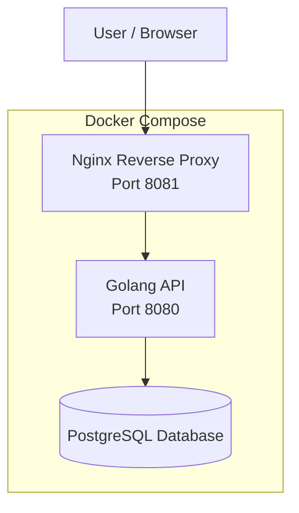

# Docker Compose Golang API

DevOps pet project demonstrating containerization of a Golang API service and deployment using Docker Compose with Nginx reverse proxy and PostgreSQL database.

## Stack

* Docker
* Docker Compose
* Golang
* Nginx
* PostgreSQL
* Linux

## Architecture

The application consists of three services:

* **Web** – Nginx reverse proxy that receives external requests
* **App** – Golang API service running inside a container
* **DB** – PostgreSQL database with persistent storage

Request flow:

Client → Nginx → Golang API → PostgreSQL



## Project structure

```
.
├── compose.yaml
├── nginx
│   └── app.conf
└── simple-golang-api
    ├── Dockerfile
    ├── go.mod
    ├── go.sum
    └── main.go
```

## Features

* Multi-stage Docker build to minimize image size
* Containerized application services
* Reverse proxy with Nginx
* Persistent PostgreSQL storage using Docker volumes
* Network isolation between services

## Docker image

Docker image is available on Docker Hub:
```
docker pull azatone/simple-golang-api:v2
```

## Running the project

Clone the repository:

```
git clone https://github.com/azatone-art/docker-compose-golang-api.git
```

Go to project directory:

```
cd docker-compose-golang-api
```

Start the services:

```
docker compose up -d
```

Check running containers:

```
docker ps
```

The application will be available at:

```
http://localhost:8081
```

## API response

Example response:

```json
[
  {
    "message": "Hello world",
    "postgres_version": "PostgreSQL 16"
  }
]
```

## Networking

* **web** → can access **app**
* **app** → can access **db**
* **db** → internal only

This configuration isolates the database from external access.

## Data persistence

PostgreSQL uses a Docker volume:

```
dbdata
```

This ensures that data is preserved even if containers are recreated.

## Possible improvements

* CI/CD pipeline using GitHub Actions
* Container image publishing to Docker registry
* Monitoring with Prometheus and Grafana
* HTTPS configuration with Let's Encrypt

## Author

Azat